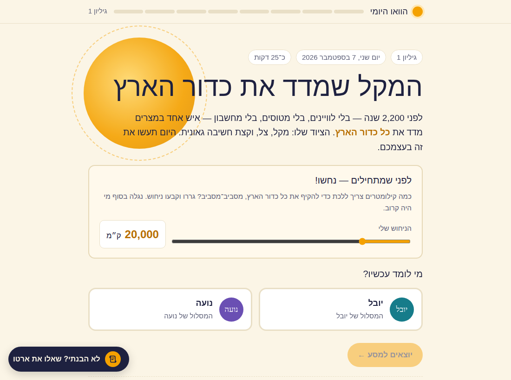
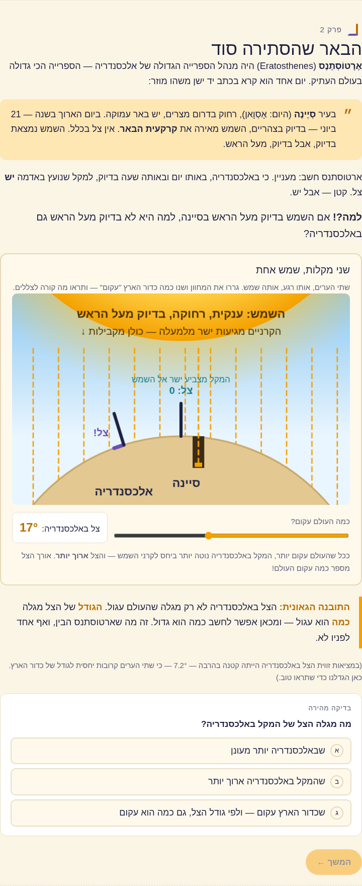
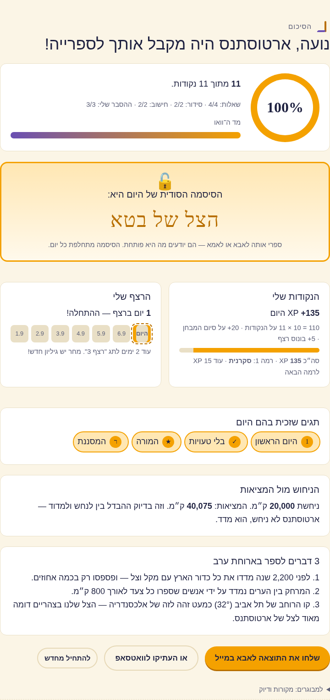
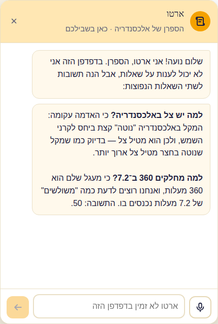

# The Daily Wow · הוואו היומי

**Every morning, a brand-new interactive lesson for your kids — built overnight by an AI agent, reviewed by another, approved by you, delivered by email.**

A new topic each day that mixes science, engineering, maths, biology, physics, space, history and geography — told as a real story, explained with hands-on simulations the kids drive themselves, and closed with a short test whose completion unlocks a secret password they can trade with you for screen time. Two content tracks (younger and older) that any number of kids can share — cousins included, each addressed in their own gender, with their own parent copied on the results — an optional *advanced* level for a kid who wants to be pushed, streaks, XP, levels, badges, and an in-page assistant they can ask anything. About 25 minutes a day.

<p align="center">
  
  
</p>
<p align="center">
  
  
</p>

**Try it:** [the live demo](https://raphacoh.github.io/daily-wow-kit/demo/) — edition #1 in Hebrew, *The stick that measured the Earth* (how Eratosthenes found the circumference of the planet with a shadow and a well), with the assistant switched on. Entrance password: **`demo`**. The demo shares the maintainer's proxy under its own small daily quota, so if the assistant says it is resting, come back tomorrow — the lesson itself always works.

## What you get

- **A tested page engine** (`template/`) — one self-contained HTML file (a fragment the release job wraps into a full document — see `template/README.md`): sequential "stations" with a progress bar, canvas/SVG simulations, quick-checks, multiple choice with explanations for every option, tap-to-order, numeric tasks, "now you are the teacher" with dictation and AI grading, results screen, the password vault, XP/levels/streaks/badges, the assistant chat, and an entrance password screen. Hebrew (RTL) out of the box, with the formula-direction problem already solved. Ships with a Playwright script that clicks through every exercise on both tracks at phone and desktop widths.
- **An assistant proxy** (`proxy/`) — three Vercel Functions so the public page can talk to Claude without exposing your API key: password-gated, 5 sessions per day, 40 questions per session, only from your own site. Free tiers all the way; a few cents of API per kid per day.
- **The prompts that run it** (`prompts/`) — the exact instructions for the three daily jobs (topic menu → nightly build → release) with placeholders, plus a single all-in-one setup prompt that has Claude build edition #1 and wire the automation for you.
- **The design notes** (`docs/architecture.md`) — how the pieces fit, the ledger schema, the security model, and the lessons that cost us two days so they don't cost you any.

## How it works, in one minute

An AI agent (Claude) runs three schedules. In the morning it emails you five topic ideas for tomorrow; you reply with a number or your own idea, or you don't. At night it settles yesterday's results (who finished — streaks and XP), builds the new edition from yesterday's page as a template, tests it in a headless browser, hands it to a separate reviewer agent that plays the kids and a strict teacher until it passes, then emails you a review (story, learning goals, test answers, today's password) and prepares the kids' email. Late morning, unless you replied HOLD or asked for changes, the release job pushes the page to GitHub Pages and sends the kids their email. The kids open the day's link (every edition keeps its own URL forever; a library page lists them all, so a missed day can be finished later — full XP, no streak), type the family password once per device, and go. When one of them tells you the daily password, you reply `✓ Name` — that feeds the streak.

## What you need

- A Claude subscription that includes **Cowork** (scheduled tasks, artifacts) and **Claude Code routines** — the automation runs entirely inside Claude, no server of yours.
- The **Gmail connector** connected to the parent's Gmail (review emails, kids' emails, reading your replies).
- A **GitHub** account (free) — the kids' site is a GitHub Pages site.
- A **Vercel** account (free) and an **Anthropic API key** (a few dollars of credit lasts months) — for the assistant on the public page.
- About an hour the first time, then a two-minute daily habit: read the review email, reply to the menu, confirm completions.

## Quick start

1. **Use this repo as is** — your agent fetches the template and prompts from its raw URLs (fork it if you want to change them).
2. **Create the site repo**: a **public** GitHub repository `daily-wow` with GitHub Pages enabled from `main` / root (Pages on a private repo needs a paid GitHub plan).
3. **Deploy the proxy**: follow [`proxy/README.md`](proxy/README.md) (Vercel import → three variables → Upstash Redis from the Storage tab → redeploy). Choose the kids' entrance password there; set `TIMEZONE` if you're not in Israel.
4. **Paste the setup prompt**: open [`prompts/setup-prompt.md`](prompts/setup-prompt.md), fill in the brackets (kids, language, times, GitHub username, proxy URL, password), paste it into a new Claude Cowork session. Claude builds edition #1 from the template, creates the parents' dashboard and the ledger, creates the two scheduled tasks, emails you the first review, and hands you the release-routine prompt.
5. **Create the release routine** at claude.ai/code/routines with your `daily-wow` repo attached, as instructed. Run it once with `REPUBLISH 1 NOTIFY-KIDS`: it publishes edition #1 and sends the kids their first email.

Prefer to wire things by hand? [`prompts/README.md`](prompts/README.md) documents each job and every placeholder.

## Customizing

- **Language** — the template is Hebrew. The setup prompt asks Claude to translate/adapt every string and drop the RTL styles for an LTR language; for RTL languages the LTR-formula isolation (`<span class="math">`) is already there and non-negotiable.
- **Kids** — the `KIDS` block at the top of the template is a map of kid id → `{name, f (feminine), age, grade, track:'younger'|'older', cc?, level?}`; the track picker, the name pills and every gendered string (`<span data-g="masc|fem">`, `G()` in JS) fill themselves from it. Several kids can share a track (a cousin on the older track with `cc:` their parent's email gets that parent copied on the completion mail, and a `reports` entry in the ledger config gets them a short daily report). `level:'advanced'` swaps in the harder twin of the numeric task (`data-level="advanced"` replaces `data-level="standard"`), addresses the chapter-5 challenge panel to that kid, and makes the assistant and the grader push harder. One kid: build one track.
- **Length and difficulty** — hard rules in the builder prompt (≈1,100 words per track, 3–4 interactives, 8–10-minute test). Change the numbers, not the structure.
- **Topics** — the menu prompt describes what makes a good candidate (2–3 domains in one story, a real person, a try-at-home moment, a local hook). Add your own constraints there.
- **Caps and cost** — `MAX_SESSIONS_PER_DAY`, `MAX_MSGS_PER_SESSION`, `MODEL` on the proxy. A `DEMO_PASSWORD` with its own `DEMO_MAX_SESSIONS_PER_DAY` lets you share a public demo without touching your kids' quota.

## Repository layout

```
template/   edition-template.html  the engine + a complete edition (Hebrew demo, generic names)
            library.html           the site's e/index.html — lists every edition from editions.json
            check.js               Playwright click-through of both tracks
proxy/      Vercel Functions: api/session, api/chat, api/status + lib/arto.js
prompts/    setup-prompt.md, topic-menu.md, nightly-builder.md, release-routine.md, README.md
docs/       architecture.md, img/
demo/       the hosted demo (edition #1 with generic names, pointed at the maintainer's proxy) — delete or repoint it in your fork
```

## FAQ

**Why not just ask my AI assistant to do all this from a prompt?** You can — that's how this started. The prompt is here (`prompts/setup-prompt.md`). What the repo adds is the part that took two days to get right: a page engine that actually works on a phone in Hebrew with readable maths, a safe way for a public page to reach Claude, and the split between what Cowork tasks can do and what Claude Code routines can do. Start from the kit and your first edition works the same day.

**Does it need Claude specifically?** The page and the proxy are plain HTML/JS and work with any browser. The automation prompts are written for Claude Cowork + Claude Code routines because they have scheduled runs, an artifact database, Gmail and GitHub access in one place. Porting the orchestration to another agent platform is possible; you'd need equivalents for those four things.

**Is it safe to put my kids' site on the public internet?** The page carries the kids' first names, the parent's email address (for the one-tap completion mail — use a dedicated alias if you prefer) and the day's secret password lightly scrambled; nothing else. The assistant is behind a password and hard daily caps; the API key never leaves the proxy. See `docs/architecture.md → Security model`.

**What does it cost?** Claude subscription you already have; GitHub, Vercel, Upstash on free tiers; Anthropic API roughly $0.01–0.03 per kid per day for the assistant and grading.

## Credits & license

Built by a dad in Israel for his two kids with Claude, over one weekend in September 2026. Edition #1 stands on Eratosthenes' shoulders. MIT license — take it, run it for your kids, make it better, send a pull request.
